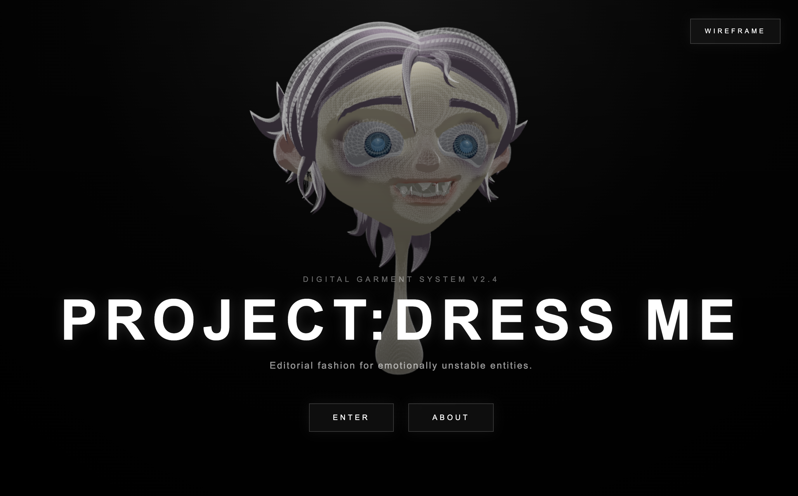
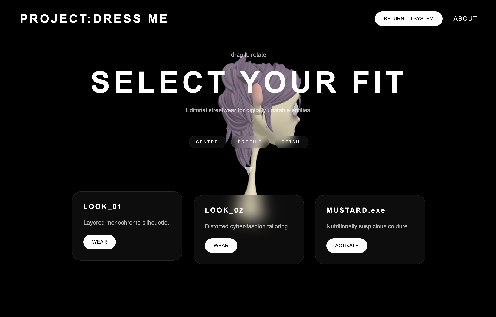
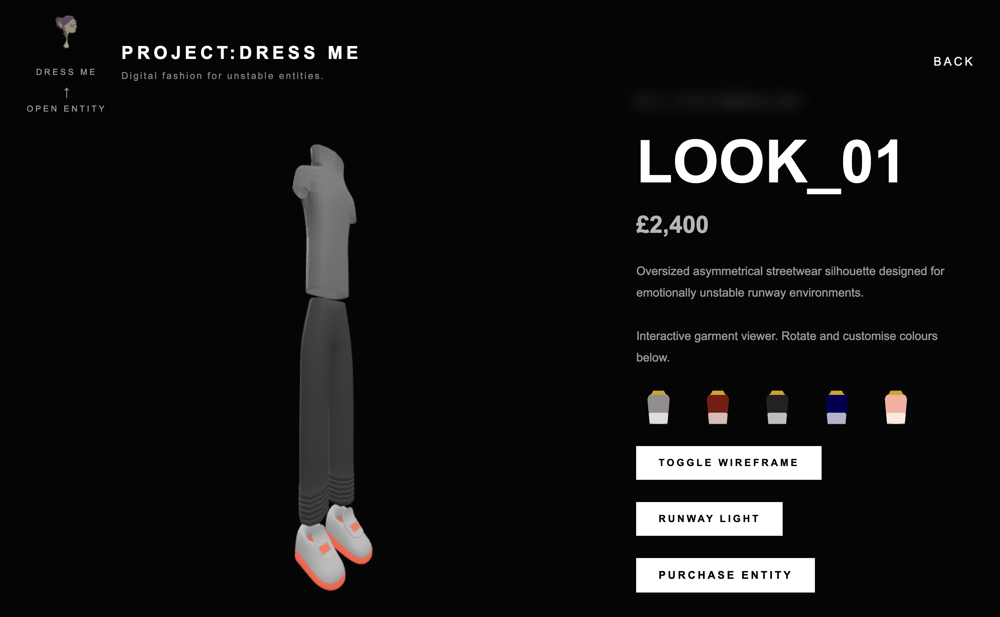
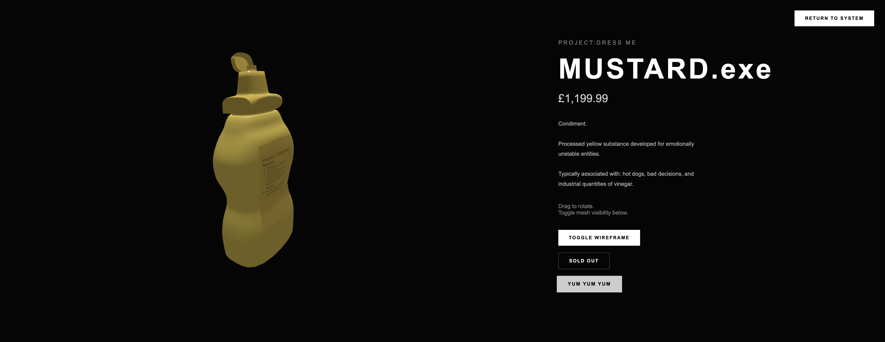

# PROJECT:DRESS ME

PROJECT:DRESS ME is an interactive 3D fashion web application developed using **Blender**, **Three.js**, **HTML**, **CSS**, **JavaScript**, and **Bootstrap**. The project explores experimental digital fashion through original 3D assets, interactive web technologies, and immersive user interaction.

## 🌐 Live Demo

**Try the project here:**  
[https://your-link-here](https://salmonicerushi.github.io/Project-Dress-Me/)

---

## Features

- Original 3D models created in Blender
- Interactive wardrobe interface
- Three.js WebGL rendering
- Dynamic lighting controls
- Wireframe mode
- Colour customisation
- Animated mascot popup
- Animated mustard bottle
- Responsive About page

## Models Included

The application contains four original 3D assets:

- **Mascot Head** – the interactive character used throughout the website.
- **LOOK_01** – an original oversized fashion concept with interactive colour controls.
- **LOOK_02** – a second experimental fashion design with additional interactive features.
- **MUSTARD.exe** – an animated mustard bottle demonstrating Blender animation integration within Three.js.

---

## Technologies Used

### 3D Modelling
- Blender
- GLB Export

### Front-End Development
- HTML5
- CSS3
- JavaScript (ES6)

### 3D Rendering
- Three.js
- WebGL
- GLTFLoader
- OrbitControls
- AnimationMixer

### Interface
- Bootstrap
- Custom CSS

---

## Interactive Features

Users can:

- Explore multiple 3D fashion pieces
- Rotate and inspect models
- Toggle wireframe rendering
- Change garment colours
- Control lighting effects
- Trigger Blender animations
- Discover hidden interactive popups
- Interact with experimental objects throughout the experience

---

## Screenshots

### Homepage


### Wardrobe


### LOOK_01


### MUSTARD.exe


## Development

The project was created as part of the **3D Applications** module at the **University of Sussex**.

All 3D models were modelled in Blender before being exported as GLB files and integrated into the website using Three.js. JavaScript was used to create interactive behaviours, animations, lighting controls, and UI functionality.

## Running Locally

Clone the repository and open the project using **Live Server** in Visual Studio Code (or another local web server). Three.js assets may not load correctly if the files are opened directly using the `file://` protocol.

```bash
git clone https://github.com/salmonicerushi/project-dress-me.git
```

---

## Author

**Arushi**

University of Sussex

Web 3D Application

Computer Science

2026
